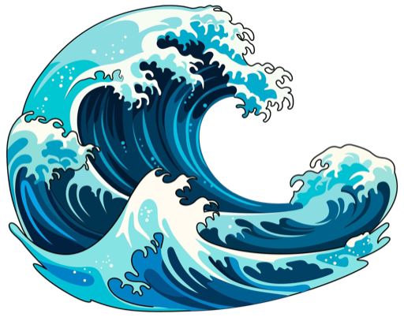

# wave

wave runs a plan to completion in [Claude Code](https://www.claude.com/product/claude-code) (only runtime for now). You break a feature into slices with dependencies, wave runs the independent ones in parallel git worktrees, lands each as a commit, and moves to the next wave until the work is done or it hits something that needs you.

## Why I built it

[This workshop](https://www.youtube.com/watch?v=-QFHIoCo-Ko) got me wanting to run [Ralph loops](https://ghuntley.com/ralph/) again. A Ralph loop is a single agent in a shell `while` loop, fresh context each pass, with state surviving in the repo (a TODO/state file plus git history). wave keeps that shape but runs on Claude Code subagents instead of a shell, and turns the flat loop into a dependency graph: main agent then runs each wave of independent slices in parallel, compounding on the last.

Planning is already solved. Matt Pocock's [grill-me](https://github.com/mattpocock/skills/tree/main/skills/productivity/grill-me) / [grill-with-docs](https://github.com/mattpocock/skills/tree/main/skills/engineering/grill-with-docs) interrogate an idea until it's sharp, then [to-prd](https://github.com/mattpocock/skills/tree/main/skills/engineering/to-prd) / [to-issues](https://github.com/mattpocock/skills/tree/main/skills/engineering/to-issues) write it up. Those land in your GitHub issue tracker; I wanted to stay local.

```
grill-me / grill-with-docs   →   sharpen the idea
to-plan / to-slices          →   write slices to .plans/   (local files, not GitHub issues)
/wave run                    →   execute them
```

So `to-plan` / `to-slices` (bundled here) do the same job but write `.plans/` files instead of issues. wave is the execution half that runs them.

It compounds on both: Matt's grilling and dependency-graphed slices for the plan, Ralph's loop-until-done patterns for the run. Then it leans on that graph to run a whole wave of independent slices in parallel instead of one task at a time, and keeps everything local: plans are files in `.plans/`, the loop is Claude Code subagents, the state is git, so there's no issue tracker, no API token, and no separate harness to run.

## Install

```
npx skills add nicotrop/wave-skills --all
```

That installs all three skills. To pick a subset, drop `--all` for an interactive prompt, or target one with `--skill wave`. Add `-g` to install globally across all projects.

Or install manually:

```
git clone https://github.com/nicotrop/wave-skills
cp -r wave-skills/skills/{wave,to-plan,to-slices} ~/.claude/skills/
```

Either way the folders land in your Claude Code skills directory (wave is Claude Code only for now). Needs Node 23+ (wave runs its TypeScript directly).

## Skills

- **`/to-plan`** — turn a sharpened idea into a plan
- **`/to-slices`** — break the plan into dependency-ordered slices in `.plans/<slug>/`
- **`/wave run`** — execute the slices wave by wave until done or a slice needs you

## How it works

A plan is `.plans/<slug>/`: a `state.json` keyed by slice with `blocked_by` edges, plus a markdown spec per slice. wave topologically sorts the graph and runs each wave of unblocked slices in parallel, one git worktree per slice off current HEAD. Each slice lands as a commit (code, state bump, and the learnings it leaves for later slices); the next wave branches off that, so work compounds.

```
validate → wave → land    (repeat until the graph drains or hits a slice that needs you)
```

wave never pushes, so review the stack afterward and squash/amend as you like. Scope a run to stop after a range:

```
/wave run <slug>          run the whole plan
/wave run <slug> -s 1-4   run slices 1–4, then stop so you can review the commits
/wave run <slug> --mode inline   skip worktrees, run slices sequentially in the main tree
```

Worktree isolation means parallel slices can't clobber each other. If two in a wave do conflict on a real file, the graph under-declared a dependency, so wave stops and points you at the `blocked_by` edge to add rather than guessing a merge.
